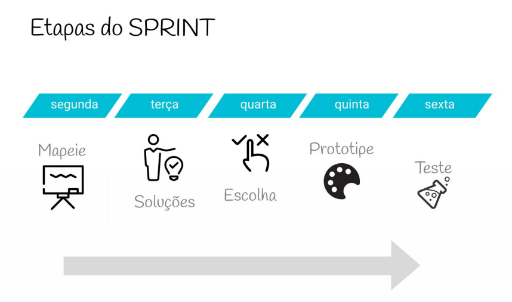
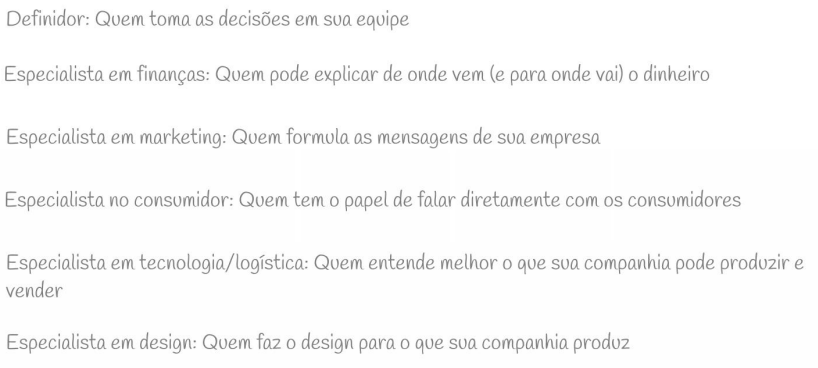

## Multimidia - SPRINT

O processo é dividido em cinco dias consecutivos, cada um com um foco específico para transformar uma ideia em um protótipo testado.

> Etapas do Sprint:
---

---
> **Segunda-feira: Mapear** 
- O objetivo do primeiro dia é entender o problema e escolher um foco 

> Preparando: 
- Escolha um grade desafio.
- Encontre um definidor.
- Equipe.

---

---

- Funcionamento.
- Definição de um objetivo a longo prazo.
- Motivos (Por que?) e finalidade (Onde).

> Liste as perguntas do sprint. 
* **Explicar o funcionamento (10h):** Alinhamento inicial sobre como o sprint funcionará.

* **Definir o objetivo de longo prazo (10h15):** Responder por que o projeto está sendo realizado e onde se espera estar em seis meses ou anos.

* **Listar perguntas do sprint (10h15):** Identificar quais questões devem ser respondidas e o que poderia causar o fracasso do projeto.

* **Traçar um mapa (11h30):** Criar um diagrama visual que mostre como os clientes interagem com o produto.

* **Perguntar aos especialistas (14h):** Entrevistas de meia hora com especialistas da equipe para obter informações adicionais.

* **Notas "Como poderíamos" (CP):** Técnica para transformar problemas em oportunidades de design.

* **Organizar e votar (16h):** Agrupar as notas CP por temas e usar pontos para votar nas ideias mais promissoras.

* **Escolha de um alvo (16h30):** Definir um público-alvo e um momento específico no mapa para focar o restante do sprint.

> **Terça-feira: Soluções** 

O foco deste dia é gerar soluções individuais através de esboços.

* **Demonstrações-relâmpago (10h):** Olhar para soluções existentes (de outros produtos ou empresas) em busca de inspiração.
* **Dividir ou agrupar (12h30):** Organizar as ideias e referências coletadas.
* **Esboço em quatro etapas (14h):**
* **Anotações:** Coletar informações pela sala (20 min).
* **Ideias:** Rabiscar soluções básicas individualmente (20 min).
* **Crazy 8s:** Dobrar um papel em oito quadros e esboçar variações rápidas de uma ideia.
* **Esboço da solução:** Criar um desenho detalhado da solução final em três painéis.

> **Quarta-feira: Escolha** 
O dia de criticar as soluções e decidir qual delas será prototipada.

* **Museu de Arte (10h):** Colar os esboços na parede para que todos possam ver em silêncio.
* **Mapa de Calor:** Usar bolinhas adesivas para marcar as partes interessantes dos esboços.
* **Críticas-relâmpago:** O facilitador narra cada solução e a equipe discute brevemente .
* **Pesquisa de intenção de voto:** Cada membro da equipe vota na sua solução favorita.
* **Supervoto:** O "Definidor" toma a decisão final sobre quais ideias serão prototipadas.
* **Batalha ou "Tudo em um":** Decidir se as ideias vencedoras podem ser combinadas ou se competirão entre si.
* **Storyboard (14h):** Desenhar cena por cena o que o usuário verá ao testar o protótipo.

> **Quinta-feira: Prototipe** 
Construir uma "fachada" realista o bastante para ser testada.

* **Qualidade:** O protótipo deve ter realidade suficiente para testar, mas sem desperdiçar tempo em detalhes desnecessários.
* **Escolha das ferramentas:** Usar softwares como Figma, ferramentas de apresentação (Keynote/PowerPoint) ou até impressoras 3D.
* **Dividir para conquistar:** Atribuir papéis na equipe, como Executores, Costureiro (que une as partes), Escritor e Entrevistador.
* **Revisão do protótipo (15h):** Garantir que tudo esteja funcionando para o teste do dia seguinte.

> **Sexta-feira: Teste** 
O momento de observar clientes reais interagindo com o protótipo.

* **Cinco entrevistados:** Realizar cinco entrevistas individuais é o suficiente para identificar a maioria dos problemas de usabilidade.
* **Ambiente de entrevista:** O entrevistador fica em uma sala com o cliente, enquanto o restante da equipe observa a transmissão ao vivo em outra sala e faz anotações.
* **Estrutura da entrevista:**
1. **Cumprimento amigável:** Deixar o cliente à vontade.
2. **Contextualização:** Perguntas sobre a rotina do cliente ligadas ao tema do projeto.
3. **Apresentação do protótipo:** Pedir que o cliente pense em voz alta.
